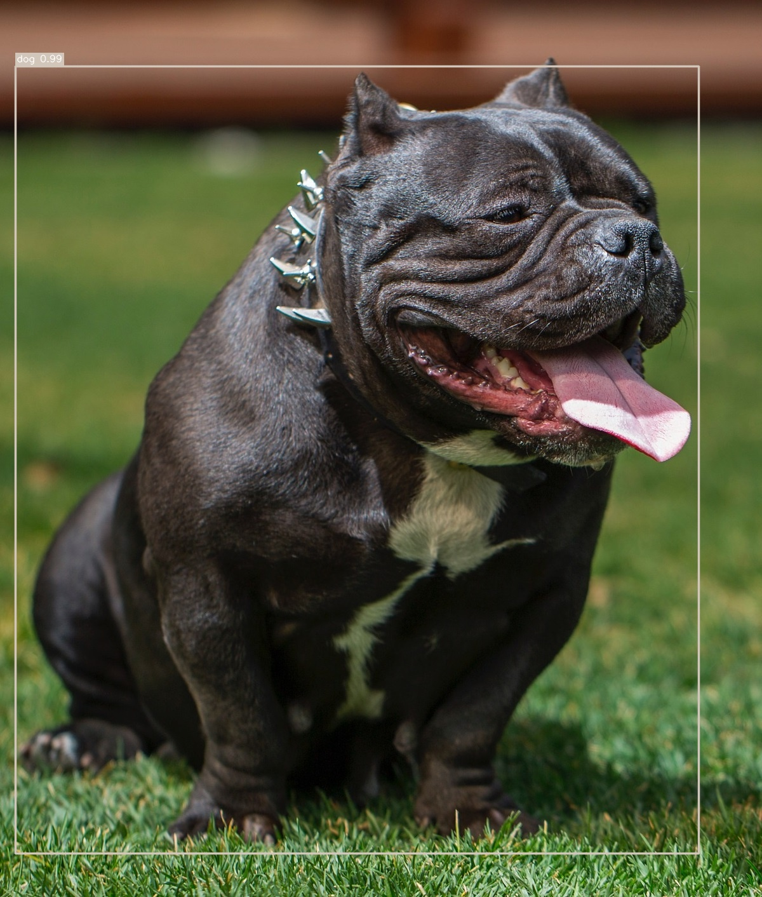
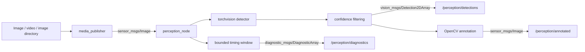

# ROS 2 AI Perception

[](https://github.com/Prajwal-Reddy25/ros2_ai_perception/actions/workflows/ci.yml)

A CPU-first ROS 2 Jazzy object-detection system built with PyTorch,
torchvision, OpenCV, `vision_msgs`, and measurable runtime diagnostics. It
publishes prerecorded media, performs COCO-pretrained detection, emits native
ROS detections and annotated images, and keeps model inference latency separate
from total processing and ROS end-to-end latency.



The retained demo above was generated locally with official
`SSDLite320_MobileNet_V3_Large` weights. It detected the CC0 sample dog at
0.991 confidence. CPU execution is fully supported; no camera, CUDA device, or
training step is required.

## Highlights

- Real ROS 2 Jazzy publisher and perception nodes, not a simulated API
- Native `vision_msgs/msg/Detection2DArray` output verified against the installed Jazzy schema
- Primary SSDLite and optional Faster R-CNN MobileNet 320 models from torchvision
- Strict CPU/CUDA/auto device policy with clear unavailable-CUDA errors
- Standalone inference, reproducible benchmark, AP50 evaluation interface, and ROS diagnostics
- 31 local unit tests, a real-weight CPU smoke test, and package-native ROS tests
- Small, checksum-verified CC0 demo image; datasets and model binaries remain outside Git

## Technology stack

Ubuntu 24.04, ROS 2 Jazzy, Python 3.12, PyTorch, torchvision, OpenCV, NumPy,
`cv_bridge`, `sensor_msgs`, `vision_msgs`, and `diagnostic_msgs`.

## Architecture



The detector pipeline is shared by the ROS node, standalone inference,
benchmark, and evaluator. See [design details](docs/design.md).

## Repository structure

```text
.
├── .github/workflows/ci.yml
├── docs/                       design and validation records
├── evaluation/                 compact AP50 manifest specification
├── media/                      licensed sample provenance
├── results/                    small genuine measured evidence
├── scripts/                    media preparation and local checks
├── tests/                      unit and real-inference smoke tests
├── training/                   explicit training scope
└── src/ros2_ai_perception/     one ament_python ROS 2 package
    ├── config/
    ├── launch/
    └── ros2_ai_perception/     nodes and modular perception code
```

## Setup

Tested on Ubuntu 24.04 with ROS 2 Jazzy installed under `/opt/ros/jazzy`.
The virtual environment deliberately inherits system packages: ROS Python,
OpenCV, NumPy, and `cv_bridge` remain apt-managed while PyTorch and development
tools are isolated in `.venv`.

```bash
source /opt/ros/jazzy/setup.bash
python3 -m venv --system-site-packages .venv
.venv/bin/python -m pip install --upgrade pip 'setuptools>=68,<69' wheel
.venv/bin/python -m pip install \
  --index-url https://download.pytorch.org/whl/cpu \
  'torch>=2.12,<2.13' 'torchvision>=0.27,<0.28'
.venv/bin/python -m pip install -r requirements-dev.txt
.venv/bin/python -m colcon build --symlink-install
source install/setup.bash
./scripts/prepare_sample_media.sh
```

Invoking colcon as `.venv/bin/python -m colcon` is important: generated ROS
console scripts then use the environment containing PyTorch while retaining
access to Jazzy's system packages. Setuptools 68.x preserves Jazzy's package
test integration and is accepted by the selected PyTorch wheel.

The media script downloads a 453 KB CC0 Wikimedia Commons image and validates
its fixed SHA-256. Official model weights are downloaded on first use to the
normal PyTorch cache and are never committed.

## Standalone inference

```bash
source /opt/ros/jazzy/setup.bash
source install/setup.bash
ros2 run ros2_ai_perception standalone_inference \
  media/downloads/demo_dog.jpg \
  --output results/annotated_local.jpg \
  --json-output results/inference_local.json \
  --device cpu --confidence 0.5
```

This command intentionally processes the first frame of an image, video, or
image directory. The ROS publisher is the streaming path for videos and image
sequences.

## ROS 2 launch workflow

```bash
source /opt/ros/jazzy/setup.bash
source install/setup.bash
ros2 launch ros2_ai_perception demo.launch.py \
  input_path:="$PWD/media/downloads/demo_dog.jpg" \
  device:=cpu frame_rate:=2.0 loop:=true
```

Inspect outputs in another sourced shell if desired:

```bash
ros2 topic echo --once /perception/detections
ros2 topic echo --once /perception/diagnostics
ros2 run rqt_image_view rqt_image_view /perception/annotated
```

The automated equivalent is `./scripts/ros_smoke_test.sh`.

## Nodes, topics, and parameters

`media_publisher` accepts an image, OpenCV-supported video, or a directory of
lexically ordered images. It publishes `sensor_msgs/msg/Image`, reports invalid
media and EOF, loops only when configured, and releases its decoder on shutdown.

| Parameter | Default | Meaning |
|---|---:|---|
| `path` | empty, required | Media file or image-directory path |
| `frame_rate` | `5.0` | Publication rate in Hz |
| `loop` | `true` | Restart at EOF |
| `output_topic` | `/perception/image_raw` | Image output |
| `frame_id` | `camera` | Published header frame |

`perception_node` consumes images and publishes detections, annotations, and
standard diagnostics.

| Parameter | Default | Meaning |
|---|---:|---|
| `model` | `ssdlite320_mobilenet_v3_large` | Supported torchvision detector |
| `device` | `cpu` | `cpu`, `cuda`, or `auto` |
| `confidence_threshold` | `0.5` | Inclusive score cutoff in `[0,1]` |
| `input_image_topic` | `/perception/image_raw` | Input image stream |
| `detections_topic` | `/perception/detections` | `Detection2DArray` output |
| `annotated_image_topic` | `/perception/annotated` | BGR annotated image output |
| `diagnostics_topic` | `/perception/diagnostics` | Runtime metric output |
| `metrics_interval_frames` | `10` | Diagnostic publication interval |
| `metrics_window_size` | `500` | Bounded timing sample count |

The installed [`perception.yaml`](src/ros2_ai_perception/config/perception.yaml)
is an example configuration showing valid parameters for both nodes. The demo
launch file continues to use its working defaults and launch arguments; it does
not load this example automatically.

Image subscription and perception-stream publishers use ROS sensor-data QoS:
best effort, volatile durability, and a small queue. This favors fresh frames
over retransmission during overload. Diagnostics use reliable QoS with depth 10
because low-rate health data should not be silently dropped.

Explicit `device:=cuda` is strict and fails when the active PyTorch build cannot
use CUDA. `device:=auto` selects CUDA only when available and otherwise uses
CPU. This repository's evidence uses the official CPU-only wheels.

## Evaluation

The dependency-light evaluator accepts a small manifest of image paths,
COCO-category labels, and pixel-space XYXY boxes. It runs real predictions and
reports class AP50, mAP50, and micro precision/recall at IoU 0.50:

```bash
ros2 run ros2_ai_perception perception_evaluate evaluation/manifest.json \
  --output results/evaluation.json --device cpu --confidence 0.05
```

See the [manifest and metric definition](evaluation/README.md). No accuracy
evaluation is retained because no labeled dataset was selected or downloaded;
the metric implementation is unit-tested, but no mAP/precision/recall value is
claimed for the demo photograph.

## Benchmarking

```bash
ros2 run ros2_ai_perception perception_benchmark media/downloads/demo_dog.jpg \
  --model ssdlite320_mobilenet_v3_large --device cpu \
  --warmup 3 --iterations 15 --output results/benchmark_ssdlite_cpu.json

ros2 run ros2_ai_perception perception_benchmark media/downloads/demo_dog.jpg \
  --model fasterrcnn_mobilenet_v3_large_320_fpn --device cpu \
  --warmup 3 --iterations 15 --output results/benchmark_fasterrcnn_cpu.json
```

Warm-up samples are excluded. Model inference timing surrounds only the model
call; processing adds tensor conversion, device transfer, synchronization, and
filtering. Approximate FPS is `1000 / mean processing milliseconds`; it is not
camera rate or ROS end-to-end throughput. The benchmark decodes one frame and
repeats that same decoded frame for every warm-up and measured iteration.

## Measured results

Measured locally on 2026-09-09 using an AMD Ryzen 9 8940HX (16 cores / 32
threads), Ubuntu 24.04.4, Python 3.12.3, PyTorch 2.12.1+cpu, torchvision
0.27.1+cpu, and the 1200×1412 CC0 image. Each benchmark used 3 warm-ups and 15
measured iterations at confidence 0.5. This short 15-iteration run is
illustrative rather than a comprehensive performance study.

| Model | Mean inference | Median | Inference p95 | Mean processing | Approx. FPS | Detections / iteration |
|---|---:|---:|---:|---:|---:|---:|
| SSDLite320 MobileNet V3 Large | 30.15 ms | 30.30 ms | 32.79 ms | 41.68 ms | 23.99 | 1 |
| Faster R-CNN MobileNet V3 320 FPN | 53.03 ms | 52.93 ms | 58.47 ms | 61.15 ms | 16.35 | 1 |

Raw reports: [SSDLite](results/benchmark_ssdlite_cpu.json) and
[Faster R-CNN](results/benchmark_fasterrcnn_cpu.json). On this one workload,
SSDLite was the lower-latency choice, which supports its use as the default.
This is a speed comparison, not an accuracy ranking.

An NVIDIA GeForce RTX 5070 Laptop GPU and driver were visible to the operating
system, but CUDA was **not tested** because the validated environment uses
CPU-only PyTorch. Training was **not performed**. The input is prerecorded, not
a physical camera. All numbers above are measured; evaluation accuracy metrics
are supported but not reported.

## Design decisions

- Torchvision-native official weights avoid another inference framework and keep model APIs testable.
- The primary SSDLite model was retained after the measured CPU comparison above.
- Domain `Detection` objects isolate ML output parsing from Jazzy message construction.
- The Jazzy message layout was inspected locally before implementing nested hypotheses and box centers.
- Bounded metrics prevent long-running nodes from accumulating unbounded samples.
- A strict explicit-CUDA policy prevents accidental CPU benchmarks labeled as CUDA.
- Fine-tuning is omitted because it does not improve the reliability of this inference-focused release without a justified dataset.

## Limitations

- Pretrained COCO categories limit which objects can be recognized.
- Standalone mode writes one annotated frame; ROS mode provides streaming.
- AP50 evaluation is suitable for small manifests, not a replacement for full official COCO evaluation.
- End-to-end ROS latency assumes publisher and subscriber clocks share a time domain; synchronize clocks across hosts.
- CUDA, physical-camera input, and hardware deployment remain unverified.
- A first run needs network access for sample media and official model weights.

## Testing

```bash
./scripts/run_local_checks.sh
./scripts/run_local_checks.sh --with-model
./scripts/ros_smoke_test.sh
```

See [local validation evidence](docs/validation.md). CI mirrors formatting,
unit tests, Jazzy build, and package tests on Ubuntu 24.04. It intentionally
does not download model weights. Public GitHub Actions validate Python quality/unit tests and ROS 2 Jazzy build/package tests.

## Troubleshooting

- `ModuleNotFoundError: torch`: build with `.venv/bin/python -m colcon`, then re-source `install/setup.bash`.
- `No module named rclpy` in `.venv`: recreate it with `--system-site-packages` after sourcing Jazzy.
- CUDA requested but unavailable: use `device:=cpu`, or install a driver-compatible official CUDA wheel and confirm `torch.cuda.is_available()` first.
- Weight download failure: check HTTPS access and retry; do not copy weights into the repository.
- No images received: ensure publisher and subscriber topic parameters match and retain compatible sensor-data QoS.
- Video rejected: confirm the codec is supported by the locally installed OpenCV/FFmpeg stack.

## License

Repository source is MIT licensed. Sample-media provenance and its independent
CC0 terms are documented in [media/README.md](media/README.md). The official
torchvision model pages document the
[SSDLite320 MobileNet V3 Large](https://docs.pytorch.org/vision/stable/models/generated/torchvision.models.detection.ssdlite320_mobilenet_v3_large.html)
and
[Faster R-CNN MobileNet V3 320 FPN](https://docs.pytorch.org/vision/stable/models/generated/torchvision.models.detection.fasterrcnn_mobilenet_v3_large_320_fpn.html)
builders and weights used here. Model weights are downloaded at runtime and are
not redistributed here. Review the applicable upstream model, weight, and
training-data terms for your use; this repository's MIT license does not grant
rights to third-party artifacts.
